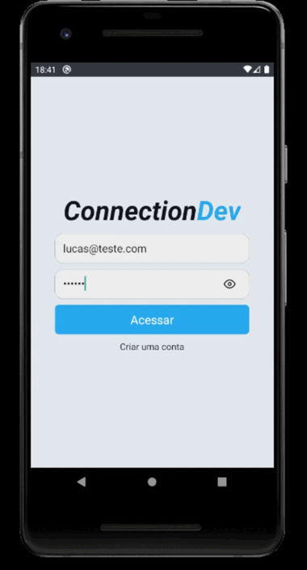

# Connection Dev

<h1 align="center">
  
</h1>

Projeto desenvolvido para treinar um pouco do que aprendi em um curso de React Native. A proposta é uma rede social simples similar ao Twitter. Para ficar mais interessante e praticar mais, procurei e vou procurar sempre ir adicionando novas funcionalidades e melhorando a usabilidade conforme for progredindo nos estudos de React-Native.

---

## 🚀 Começando

Essas instruções permitirão que você obtenha uma cópia do projeto em operação na sua máquina local para fins de desenvolvimento e teste.

---

### 📋 Pré-requisitos

Para clonar e executar este aplicativo, você precisará de [Git](https://git-scm.com), [NodeJs](https://nodejs.org/en/) e [Android Studio](https://developer.android.com/studio) Instalado em seu computador.

---

## :rocket: Tecnologias usadas

- [Async Storage](https://github.com/react-native-async-storage/async-storage)
- [date-fns](https://github.com/date-fns/date-fns)
- [React Native](https://reactnative.dev/)
- [React Native Animatable](https://github.com/oblador/react-native-animatable)
- [React Native Firebase](https://rnfirebase.io/)
- [React Native Image Picker](https://github.com/react-native-image-picker/react-native-image-picker)
- [React Navigation](https://reactnavigation.org/)
- [Styled-components](https://styled-components.com/)
- [Vector-Icons](https://github.com/oblador/react-native-vector-icons)

---

## :file_folder: Como Instalar 

```bash
  # Clone o repositório
  $ git clone https://github.com/lucastak/connectiondev
  # Acessado a pasta do repositório
  $ cd ConnectionDev 
  # instalando as dependências
  $ yarn or npm install
  # compilar o projeto no dispositivo
  $ npx react-native run-android
  # Iniciar o projeto
  $ npx react-native start
```